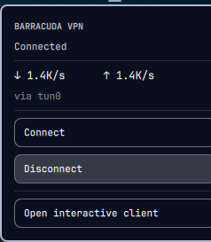

# Barracuda VPN

An [Omarchy](https://omarchy.org) bar widget that brings the Barracuda VPN
tunnel up and down, and shows what is going through it.

The vendor's client is a terminal command with two password flags. This is the
part you actually use day to day: a shield when the tunnel is up, a globe when
it is not, and one click either way.



## Install

```bash
omarchy plugin add https://github.com/ignacehelsen/omarchy-barracuda-vpn.git --enable
```

Needs `iproute2` and `coreutils`, which Omarchy already has, and the Barracuda
client itself at `/usr/local/bin/barracudavpn`. That client is **proprietary and
not shipped here** — install it from your organisation, and note it expects to
be setuid root (`4755`) so the widget can bring the tunnel up without a
password prompt of its own.

## What it does

- **The glyph on the bar** is a shield while the tunnel is up and a globe while
  it is not: tunnelled traffic against traffic going out in the open.
- **Left click** opens the panel — Connect, Disconnect, and the current state.
- **Right click** launches the interactive client in a terminal, for anything
  the panel does not cover.
- **Throughput** is sampled from `/proc/net/dev` on the tunnel interface while
  the panel is open, and the bar glyph is kept honest by a slower poll while it
  is closed.

## The credentials file

Connecting unattended means the passwords have to come from somewhere. The
helper reads a plain text file — `~/creds.txt` unless you point *Credentials
file* elsewhere — and matches these lines by exact prefix:

```
Server Password: <your server password>
Certificate password: <your certificate password>
```

`License password:` is accepted as a synonym for the certificate line. Anything
else in the file is ignored. Keep it to yourself:

```bash
chmod 600 ~/creds.txt
```

The file is read only when you press Connect, and nothing in this repository
contains or logs its contents.

> **Worth knowing:** the client takes its passwords as `--keypwd` and
> `--serverpwd` command-line arguments, and command lines are readable by other
> processes on the machine through `/proc`. That is how the vendor's CLI works
> and cannot be fixed from this side — so on a machine you share with other
> logins, this file and this widget are as private as that argument list is.

## Settings

| Setting | Default | |
| --- | --- | --- |
| Credentials file | `~/creds.txt` | Where the passwords are read from. A leading `~` is expanded. |

## The command line

`vpn-ctl` works on its own:

```
status              1 when the tunnel is up, 0 otherwise
start               bring it up using the credentials file
stop                bring it down
speeds              "<down_bps> <up_bps> <iface>" over a short sample
```

```bash
./vpn-ctl --creds ~/work-creds.txt start
```

`$BARRACUDA_CREDS` does the same as `--creds` for a shell session.

## Licence

MIT.
